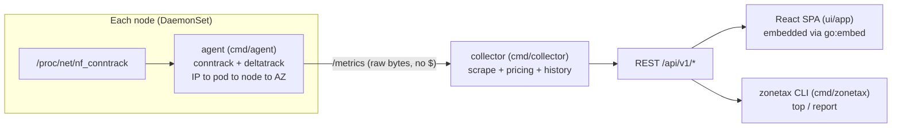

# AGENTS.md: ZoneTax agent brief

Read this first in every session. It is the durable memory of the project. Keep it short and
current. Detailed history lives in [docs/PROGRESS.md](./docs/PROGRESS.md). Private,
environment-specific notes (cluster names, contexts) live in the gitignored
`.jcode/prompt-overlay.md`, never in committed files.

## What ZoneTax is

Open-source (Apache 2.0) Kubernetes tool that shows **cross-AZ network traffic and its $ cost in
real time** (AWS/EKS first), before it shows up on the cloud bill. Fills a gap OpenCost leaves
open (opencost#2464). Owner: `gargkrishna730` (personal GitHub, personal project).
Repo: https://github.com/gargkrishna730/zonetax

## Architecture



| Path | Role |
|---|---|
| `cmd/agent` | DaemonSet binary. hostNetwork, runs as root, privileged init sets `nf_conntrack_acct=1` |
| `cmd/collector` | Scrapes agents every 30s, serves API + UI on :8080 |
| `cmd/zonetax` | CLI: `top`, `report`, `version`. Uses `/api/v1/map` + `/history`. `--url`/`ZONETAX_URL`, `--json` |
| `internal/conntrack` | Parses `/proc/net/nf_conntrack` |
| `internal/deltatrack` | Turns cumulative per-connection bytes into per-sample deltas (fixed ~80x overcount) |
| `internal/podindex`, `azmap` | client-go informers, IP to pod/workload, node label `topology.kubernetes.io/zone` |
| `internal/aggregator`, `metrics` | Per (srcAZ, dstAZ, ns, workload, dst_workload) byte counters |
| `internal/scrape`, `costengine`, `pricing` | Collector side: scrape, apply YAML price table ($0.01/GB each direction) |
| `internal/collector/history.go` | In-memory hourly buckets via snapshot diffing, honest `has_data`/`complete` flags |
| `internal/api` | `/healthz`, `/api/v1/costs`, `/top`, `/history?range=1h\|6h\|24h\|7d`, `/map` |
| `ui/app` | Vite + React 19 + TS + @xyflow/react. Vitest + Testing Library |
| `deploy/helm/zonetax` | Helm chart, source of truth. Image tag defaults to appVersion |
| `deploy/manifests/install.yaml` | GENERATED by `hack/gen-manifests.sh`, CI fails if stale |
| `.github/workflows` | `ci.yml` (go + ui + helm lint + manifest drift), `build-push.yml` (multiarch GHCR images), `release.yml` (on tag: CLI binaries, chart, install.yaml, gh-pages Helm index) |

## Commands (run before every commit)

```bash
gofmt -l . && go vet ./... && go build ./... && go test ./... -count=1
helm lint deploy/helm/zonetax && ./hack/gen-manifests.sh   # commit install.yaml if it changed
cd ui/app && npm ci && npm run lint && npx tsc -b && CI=true npm test && npm run build
```

The collector embeds `ui/dist`, so build the UI before building the collector image locally.

## Working rules (learned the hard way)

1. **Never fabricate data.** Missing/partial windows must show as missing/partial, never 0 or
   extrapolated. This is a core product principle.
2. **Counters are cumulative.** conntrack bytes and Prometheus totals are cumulative. Always diff
   (deltatrack, history snapshots). This class of bug happened twice.
3. **Verify against live data** before calling something done (curl the API, screenshot the UI with
   Playwright). User expects evidence, not claims.
4. **Think as SRE + product designer** for UI work. Interactive, APM service-map style
   (draggable nodes, directed source to destination edges, zoom, drill-down). Static diagrams were
   rejected repeatedly.
5. **No company, cluster, or account names** in any committed file (code, comments, docs, commit
   messages). Say "a real 3-AZ EKS test cluster".
6. Pushes go to the personal GitHub account. Images go to GHCR, multiarch (amd64 + arm64).
7. `kubectl rollout restart` kills existing port-forwards. Restart them after every deploy.
8. User is token-budget sensitive: plan briefly, then act fast, avoid long trial-and-error loops.
9. Commit as you go, update `docs/PROGRESS.md` and this file when state changes.

## Current status (update me)

- Done: M0 to M3, M5 CLI, accuracy fix (~80x to ~4x vs AWS bill), observability redesign, service
  map, cost FAQ, demo GIF, Helm repo + raw manifest + release workflow (2026-10-03), collector
  memory fix (history downsampling + GOMEMLIMIT, 2026-10-03).
- **Released v0.1.0 (2026-10-03).** Helm repo live at https://gargkrishna730.github.io/zonetax,
  Pages enabled on `gh-pages`. Next release: just push a new `vX.Y.Z` tag.
- Dev cluster still runs the `latest`-tagged install from Helm revision 6 (pre-v0.1.0 chart).
- **Next:** M4 alerting (Slack webhook), persistent history, eBPF, multi-cloud.

## Memory system (how context survives)

- `AGENTS.md` (this file): auto-loaded every session. Brief, rules, status.
- `docs/PROGRESS.md`: timeline, decisions, session log. Append an entry per session.
- `.jcode/prompt-overlay.md`: gitignored private ops notes (cluster context, accounts).
- Jcode memory: user preferences and project pointer.
