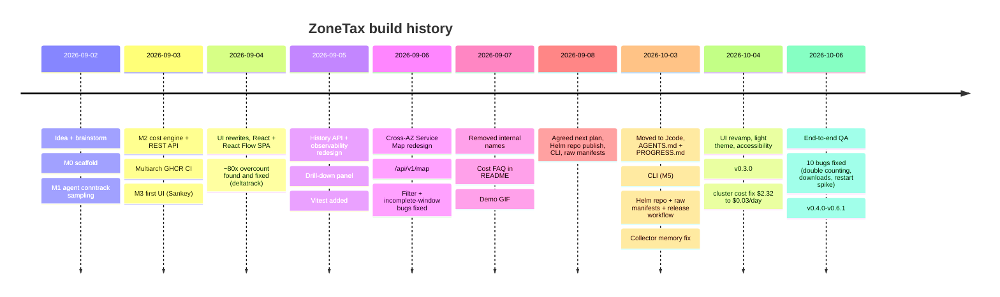

# Progress log

Chronological record of how ZoneTax was built and why. Append new entries at the bottom.
For the quick brief, see [AGENTS.md](../AGENTS.md). For milestone detail, see [ROADMAP.md](../ROADMAP.md).

## Timeline

## Key decisions

| Decision | Why |
|---|---|
| conntrack over eBPF for MVP | Works on any node, simple. eBPF is v2 |
| Node labels for AZ, not IMDS | No extra IAM, no cloud-specific code |
| Agent emits raw bytes only, collector prices | Keep agent dumb and fast, one place for pricing |
| Cross-AZ priced both directions ($0.02/GB effective) | Matches how AWS bills; single-direction was a 2x undercount |
| React + @xyflow/react instead of hand-rolled D3/SVG | Five SVG iterations failed on drag/zoom. Delegate to a graph library |
| Persistent drill-down panel, not tooltips | Tooltips cap at top-5 and cannot be clicked into |
| Snapshot diffing for history | Collector totals are cumulative counters |
| Honest `has_data` / `complete` flags | Never fabricate or extrapolate missing windows |
| ZoneTax counts its own scrape traffic | A cost tool should not hide its own footprint (~$0.0002/day measured) |
| Raw manifests generated from Helm (planned) | Avoid two hand-maintained copies drifting |

## Accuracy vs AWS billing

- Pre-fix: ~$173/day extrapolated vs ~$2.13/day AWS (`DataTransfer-Regional-Bytes`), ~80x.
- Root cause: conntrack `bytes=` is cumulative per connection lifetime, was re-added every tick.
- Post-fix: ~$8.35/day on a 10-min sample, ~4x. Residual explained by AWS figure being
  account-wide and short-sample extrapolation. A proper 24h comparison was requested on
  2026-09-07; the README FAQ cites ~$1.94/day real spend over a 28h session.

## Known open items

- Alerting (M4) not started.
- DaemonSet rollouts can stall on memory-pressured nodes (delete pods manually).

## Session log

### 2026-10-03 (Jcode)
Previous Hermes session (2026-09-02 to 2026-09-24, ~3500 messages) exhausted its context. Recovered
state from the Hermes session DB, wrote `AGENTS.md` (auto-loaded brief) and this file so future
sessions start with full context. Next: Helm repo publish, then CLI, then generated manifests.

### 2026-10-03 (Jcode, part 2): CLI, Helm, release
- `cmd/zonetax` CLI (`top`, `report`, `version`), tests against a fake collector.
- Found live: collector up 25 days at its 256Mi limit, all agent scrapes timing out, `/costs`
  taking ~60s. Cause: history kept every 30s snapshot for 7 days (~20k, each with a route map).
  Fix: snapshots older than 1h downsampled to 5-min slots (~2k for 7d), plus GOMEMLIMIT.
- `release.yml` on tag publishes CLI binaries, chart, install.yaml, and the gh-pages Helm index.
- `hack/gen-manifests.sh` generates `deploy/manifests/install.yaml`, CI drift check.
- Chart: image tag defaults to appVersion (was `latest`), explicit namespaces.
- Released **v0.1.0**: GitHub Release (4 CLI binaries, chart, install.yaml, checksums), images
  tagged 0.1.0, Helm repo on GitHub Pages. Verified as a new user: `helm repo add` + `search` +
  `template` (pinned 0.1.0 images), install.yaml kubectl dry-run, downloaded CLI binary runs.

### 2026-10-03 (part 3): persistent history, v0.2.0
- History saved to `/data/history.json.gz` every 5 min + on shutdown, reloaded on start.
  7 days x 40 routes measured at ~0.7 MB. emptyDir default, `collector.persistence.enabled` PVC.
- Downtime is a gap marker: fully-down hours = no data, partly-down = partial, never back-filled.
- Found while designing it: history diffed raw merged agent totals, so one failed agent scrape
  made the next cycle look like a counter reset (fake spike). Now per-agent observed deltas.
- Found deploying it: switching an existing Deployment to `type: Recreate` is rejected by the
  API server; used RollingUpdate maxSurge 0 instead. `--reuse-values` dropped the new `size`
  default (PVC rendered "0"); template now defaults to 1Gi.
- Live test on dev: deleted the collector pod, new pod logged "restored history", history start
  unchanged, totals continued (371 MB -> 405 MB), 15m window across restart = incomplete.
- Follow-up live checks: a window ending between the last periodic save and the pod kill had
  routes (so the shutdown save ran); a window inside history spanning the restart is
  complete=false, while windows entirely before or after it are complete=true.

### 2026-10-04: accuracy check + UI revamp, v0.3.0
- Accuracy: ZoneTax $2.017/day vs AWS $2.094/day for this cluster's EC2 instances (-3.7%),
  using Cost Explorer per-resource data (`docs/accuracy.md`). Earlier "4x" came from comparing a
  10-minute sample against the account-wide total.
- UI audit before: axe passed, but legend colours did not match the map, red/green scale not
  colour-blind safe, partial windows painted every edge amber (cost hidden), spend chart hidden,
  table rows / map not keyboard reachable, no visible focus, sub-cent noise ($0.004897).
- After: single magma-style cost scale (contrast-tested), dark + light themes, KPI cards with
  projected per day/month, promoted spend chart, layered workload map, simpler filters, full
  keyboard support. axe 0 violations dark + light on the deployed build; colour-blindness
  simulation checked; no horizontal overflow at 390 px.

### 2026-10-06: end-to-end QA, v0.4.0 to v0.6.1
Full QA against the live cluster (plan: docs/qa/qa-plan.md, results: docs/qa/report-2026-10-06.md).
Ten bugs found and fixed, including three that made the numbers wrong:
- every cross-node connection counted twice (1 GiB read as 2.16 GB),
- downloads not counted at all (1 GiB read as 0.003 GB),
- agent restarts reporting ~4 GB of fake traffic from pre-existing connections.
These first two partly cancelled out, which is why the earlier "within 4% of the AWS bill" looked
good; that claim is corrected in docs/accuracy.md. After the fixes, controlled tests measure
within 1%. Also: traffic via Services and node IPs is now attributed, unattributed traffic is
reported instead of silently dropped, partial windows say how much time was missed, the agent
DaemonSet rollout no longer stalls, and the sticky header no longer overlaps the page.
