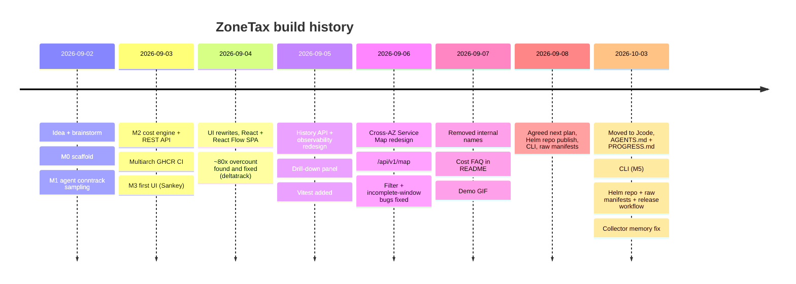

# Progress log

Chronological record of how ZoneTax was built and why. Append new entries at the bottom.
For the quick brief, see [AGENTS.md](../AGENTS.md). For milestone detail, see [ROADMAP.md](../ROADMAP.md).

## Timeline

## Key decisions

| Decision | Why |
|---|---|
| conntrack over eBPF for MVP | Works on any node, simple. eBPF is v2 |
| Node labels for AZ, not IMDS | No extra IAM, no cloud-specific code |
| Agent emits raw bytes only, collector prices | Keep agent dumb and fast, one place for pricing |
| Cross-AZ priced both directions ($0.02/GB effective) | Matches how AWS bills; single-direction was a 2x undercount |
| React + @xyflow/react instead of hand-rolled D3/SVG | Five SVG iterations failed on drag/zoom. Delegate to a graph library |
| Persistent drill-down panel, not tooltips | Tooltips cap at top-5 and cannot be clicked into |
| Snapshot diffing for history | Collector totals are cumulative counters |
| Honest `has_data` / `complete` flags | Never fabricate or extrapolate missing windows |
| ZoneTax counts its own scrape traffic | A cost tool should not hide its own footprint (~$0.0002/day measured) |
| Raw manifests generated from Helm (planned) | Avoid two hand-maintained copies drifting |

## Accuracy vs AWS billing

- Pre-fix: ~$173/day extrapolated vs ~$2.13/day AWS (`DataTransfer-Regional-Bytes`), ~80x.
- Root cause: conntrack `bytes=` is cumulative per connection lifetime, was re-added every tick.
- Post-fix: ~$8.35/day on a 10-min sample, ~4x. Residual explained by AWS figure being
  account-wide and short-sample extrapolation. A proper 24h comparison was requested on
  2026-09-07; the README FAQ cites ~$1.94/day real spend over a 28h session.

## Known open items

- Alerting (M4) not started.
- DaemonSet rollouts can stall on memory-pressured nodes (delete pods manually).
- History is in-memory, lost on collector restart.

## Session log

### 2026-10-03 (Jcode)
Previous Hermes session (2026-09-02 to 2026-09-24, ~3500 messages) exhausted its context. Recovered
state from the Hermes session DB, wrote `AGENTS.md` (auto-loaded brief) and this file so future
sessions start with full context. Next: Helm repo publish, then CLI, then generated manifests.

### 2026-10-03 (Jcode, part 2): CLI, Helm, release
- `cmd/zonetax` CLI (`top`, `report`, `version`), tests against a fake collector.
- Found live: collector up 25 days at its 256Mi limit, all agent scrapes timing out, `/costs`
  taking ~60s. Cause: history kept every 30s snapshot for 7 days (~20k, each with a route map).
  Fix: snapshots older than 1h downsampled to 5-min slots (~2k for 7d), plus GOMEMLIMIT.
- `release.yml` on tag publishes CLI binaries, chart, install.yaml, and the gh-pages Helm index.
- `hack/gen-manifests.sh` generates `deploy/manifests/install.yaml`, CI drift check.
- Chart: image tag defaults to appVersion (was `latest`), explicit namespaces.
- Released **v0.1.0**: GitHub Release (4 CLI binaries, chart, install.yaml, checksums), images
  tagged 0.1.0, Helm repo on GitHub Pages. Verified as a new user: `helm repo add` + `search` +
  `template` (pinned 0.1.0 images), install.yaml kubectl dry-run, downloaded CLI binary runs.
